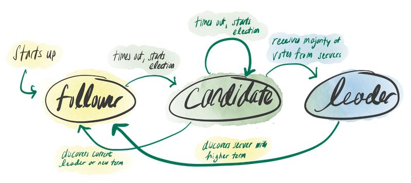
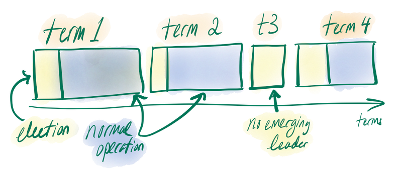

#  Leeky Raft

An implementation of *Raft* as described in [this paper](https://pdos.csail.mit.edu/6.824/papers/raft-extended.pdf) with substantial help from the accompanying [Student's Guide to Raft](https://thesquareplanet.com/blog/students-guide-to-raft/). Leeky Raft serves as the consensus layer for [Chordish DeFiSh](https://github.com/slin63/chord-dfs).

## Setup

1. Start up Raft cluster
   1. `docker-compose build && docker-compose up --remove-orphans --scale worker=<num-workers>`
      1. For `num-workers`, 5 workers is recommended. You can scale to as many nodes as you want though, but your Raft might sink.
2. Send whatever entries you want with
   1. `CONFIG=$(pwd)/config.json LEADER=0 CLIENT=1 go run ./cmd/raft <your-entry>`

## About Leeky Raft

Leeky Raft was created to be used as the consensus layer inside of Chordish DeFiSh, a distributed file system. Leeky Raft ensures that all nodes within a network have up-to-date information about the collective state of the system, AKA what files are *in* the distributed filesystem, and what steps the system took to get there.

If you're not familiar with the problem of consensus, I wrote a brief explanation of it here: [chronicpizza.net/posts/consensus](https://www.chronicpizza.net/posts/consensus/).

### Leeky Raft: a Fantastical & Absurd Exploration

If you're comfortable with the mechanics of Raft already, or just don't really care that much, you can just skip straight to reading this post: [chronicpizza.net/posts/leekyraft](https://www.chronicpizza.net/posts/leekyraft/). It's entertaining, supposedly. 

If not, you can read about Raft's basic workings below.

### Why Raft?

Chordish DeFiSh is a distributed file system that uses consistent hashing to equally distribute K files across N nodes. At its core, DeFiSh is a *replicated state machine*.

Replicated state machines are collections of servers that have identical copies of the same state and can use those copies to maintain availability even when some servers are down. Many replicated state machines are implemented by using a replicated log, an ordered collection of entries, that describes all changes in state or arbitrary actions that are run against the system. Each node has its own copy of the replicated log. An example is as follows:

```python
# Input actions:
1. A user adds a file f to the system.
2. They read the contents of f.
3. They delete f.

# Resulting log:
ADD f
READ f
DELETE f
```

The main advantage of using replicated logs is that, in deterministic systems, any state machine can determine the state of the entire system by executing its log entries sequentially.

DeFiSh uses replicated logs to keep track of the state of the distributed file system. Raft is a consensus algorithm designed to manage replicated logs of this type. Perfect!

### Raft's Rules

Raft depends on a single leader who receives information from a client, forwards it to all known servers, and has complete responsibility for log replication. This single leader approach allows for easy understandability of Raft's mechanisms and also allows Raft to break the consensus problem into 3 subproblems:

1. *Leader election*: a new leader must be chosen when an existing leader fails.
2. *Log replication*: the leader must accept log entries from clients and replicate them across the cluster, forcing the other logs to agree with its own.
3. *Safety*: if any server has applied a particular log entry to its state machine, then no other server may apply a different command for the same log index. This is satisfied by guaranteeing the following set of properties:
   - *Election Safety*: at most one leader can be elected in a given term.
   - *Leader Append-Only:* a leader never overwrites or deletes entries in its log; it only appends new entries.
   - *Log Matching*: if two logs contain an entry with the same index and term, then the logs are identical in all entries up through the given index.
   - *Leader Completeness*: if a log entry is committed in a given term, then that entry will be present in the logs of the leaders for all higher-numbered terms.
   - *State Machine Safety*: if a server has applied a log entry at a given index to its state machine, no other server will ever apply a different log entry for the same index

In addition to the leader, Raft has two more roles that a node can take. *Followers* are passive, issuing no requests of their own, but responding to requests from leaders and candidates. *Candidates* are only present during the election phase, and can either transition back to followers or become the new leader.



Raft separates time into *terms* of arbitrary length, each term starting with an election which will decide a leader for the remainder of the term. Some elections can result in *split votes*, or multiple leaders being elected. In this case no leader is decided and a new term begins, repeating until eventually a single leader is selected.



Raft nodes communicate with one another through remote procedure calls (RPCs). RPCs are just messages that contain data and can execute specific, predefined functions on the server that receives them. Raft has two RPCs.

- *AppendEntries*: initiated by leaders to replicate log entries, doubling as a heartbeat.
- *RequestVote*: initiated by candidates during the elections to request votes.

### What We Have So Far & Additional Reading

Raft is a consensus algorithm that is built around the idea of a single leader. This allows Raft to breakdown the consensus problem into three subproblems: leader election, log replication, and guaranteeing safety. Nodes in a Raft cluster can take any one of three roles: candidate, follower, or leader. However, to ensure safety, only one node can be a leader at any given time.

Time in Raft is separated into terms, which always begin with an election, triggered by a leader's failure. Raft is wonderfully simple, only using two RPCs to communicate: AppendEntries and RequestVote.

I will not discuss the many intricacies of Raft's mechanics here. I originally intended to do so, but realized the paper does a good job at describing Raft succinctly and exactly, far better than I will. It would be unfair to you to try and describe it myself.

You won't *need* to read the paper to appreciate the next section, but if you find any of this at all interesting, the paper is very accessible and not at all jargony or dense.

The paper is available here: [In Search of an Understandable Consensus Algorithm](https://pdos.csail.mit.edu/6.824/papers/raft-extended.pdf).

## Running "tests"*

1. `CONFIG=$(pwd)/config.json go test -v ./internal/...`

\* These tests don't work.

