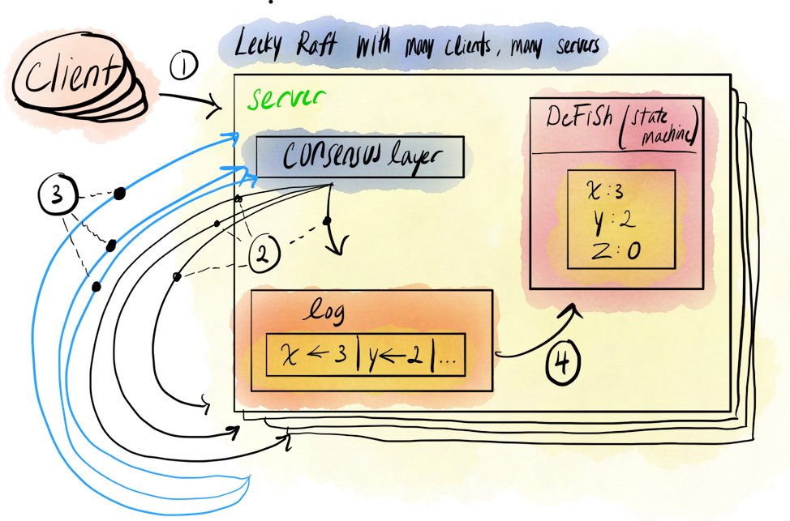

#  Leeky Raft

An implementation of *Raft* as described in [this paper](https://pdos.csail.mit.edu/6.824/papers/raft-extended.pdf) with substantial help from the accompanying [Student's Guide to Raft](https://thesquareplanet.com/blog/students-guide-to-raft/). Leeky Raft serves as the consensus layer for [Chordish DeFiSh](https://github.com/slin63/chord-dfs).

## Setup

1. Start up server cluster
   1. `docker-compose build && docker-compose up --remove-orphans --scale worker=<num-workers>`
      1. For `num-workers`, 5 workers is recommended. You can scale to as many nodes as you want though, but your Raft might sink.
2. Send whatever entries you want with
   1. `CONFIG=$(pwd)/config.json LEADER=0 CLIENT=1 go run ./cmd/raft <your-entry>`

## Leeky Raft, Briefly

Leeky Raft was created to be used as the consensus layer inside of Chordish DeFiSh, a distributed file system. Leeky Raft ensures that all nodes within a network have up-to-date information about the collective state of the system, AKA what files are *in* the distributed filesystem, and what steps the system took to get there.

To explain the necessity for Leeky Raft requires us to explain a fundamental problem of distributed systems: *consensus*.

### The Problem with Consensus
#### Consensus, Briefly

You have *N* processes in a network. These processes communicate with one another by sending messages. Messages are packets of information. Any of those processes may fail at any time, becoming unresponsive to incoming messages and not sending out any messages themselves. 

Any responsive, non-failed process is called a *correct* process. The problem of consensus is described in the following three requirements:

- *Agreement*: You must try and get all correct processes to agree on a single value, as proposed by any single process in the network. 
- *Validity:* All processes that return a value must have that value be a function of some input value from some other correct process.
- *Termination*: All correct processes must eventually return a value.

Consensus exists everywhere around us. In all the websites that we use, in our home devices, our laptops and phones, even in our basic human interactions. 

People implement and exercise extremely convoluted solutions to far more rigorous forms of the consensus problem every day. Think of a group of friends deciding where to eat as a consensus problem.

- **Formal prompt**: A set of *N* friends, *f*, where any element of *f* ∈ {Mike, Samantha, David, James} must agree on some place to eat, *r*, where *r* ∈ {Any of the 26,618 eateries in New York City.}

- **Example**: Mike wants falafel cart. But Samantha hates falafel because of an irrational hatred for chickpeas. She proposes dollar pizza. James hates dollar pizza, because it gave him diarrhea last week, and the week before. Mike hears everyone's complaints and suggests Chinese food, which has neither chickpeas or pizza in it. David catches up to the group, after lagging behind while petting a dog, and proposes dollar pizza. Everyone explains to David why they can't do that.

  Suddenly, a giant meteor strikes the Earth. Nobody eats anywhere.

  12 years later, having survived the apocalypse, all friends in *f*, except for Mike (RIP), who is succeeded by his 11 year old son, Muz∆¥løek, born of a world rapt in horror and uncertainty, rejoin and decide on a place to eat: the pile of burnt out cars on Parkside & Bedford in Brooklyn. They're going to have stone soup.

This is a nightmare. 

Not because of the post-apocalyptic nature of this scenario. Also not because they're going to the pile of burnt out cars on Parkside & Bedford to have stone soup, which is really the worst thing on the menu there. 

It's a nightmare because out of the *N* processes, any single one can propose a value. But now these processes also have the ability to *veto* and remove values from the pool of choices. Also, there are arbitrary *pools of choices*, as opposed to the binary consensus problem we described earlier. Not to mention that these processes can lag behind and re-propose previously vetoed values, wasting network time. Then, without warning, we see that the system is one that can spontaneously fail. 

Finally, despite all the setbacks and an incredible amount of network downtime, all *correct* processes rejoin and decide on a value. Also, in a turn of events completely irrelevant to our consensus problem, the *Mike* process managed to spawn a child process, Muz∆¥løek, who is allowed to participate in the network. 

This is consensus.

So now that you have a feel for what the consensus problem is and how hairy it can become, let's talk about why it's so important.

#### Consensus is Fundamental

Consensus serves as the basis for countless problems inside distributed systems. I'll just list a few here.

- *Reliable Multicast*: Guarantee that all processes within a network receive the same update in the same order.
- *Membership/Failure Detection*: Having processes maintain a local list of all other processes in a network, updating on membership changes like processes leaving or failing.
- *Leader Election*: Agreeing on a single leader process and notifying the entire network of the new leader .
- *Mutual Exclusion/Distributed Locking*: Allow only one process at a time to access a critical resource, such as a file.

Any protocol for solving the basic problem of consensus also, by extension, can be leveraged to solve all of the above problems as well. Isn't that amazing? 

With so many great minds in the field of distributed computing, consensus must have so many great and proven solutions! Aren't you excited?

#### Consensus is Impossible

Surprise! Formally proven in *[Impossibility of Distributed Consensus with One Faulty Process](https://groups.csail.mit.edu/tds/papers/Lynch/jacm85.pdf)*, consensus, although possible to achieve in *synchronous* systems, is impossible in an *asynchronous* system. The paper describes consensus as the following:

> an asynchronous system of [unreliable] processes . . . [trying] to agree on a binary value (0 or 1). Every protocol for this problem has the possibility of nontermination, even with only one faulty process.

To understand the asserted point here, it is important to distinguish some key differences between synchronous and asynchronous system models. 

In a *synchronous system model*, there is a known upper bound on message delivery time between correct processes. If a process hasn't responded in that amount of time, it's failed. An example of a synchronous system might be a single supercomputer doing a lot of calculations. 

In an *asynchronous system model*, messages can be delayed indefinitely, taking anywhere from 1ms to a year to never arriving to their destination. An example of an asynchronous system might be several computers, working together to do a larger calculation, assigning work and returning results over the network. 99% of real world over-network applications fall into this category.

Imagine a synchronous system trying to achieve consensus. If a process takes too long to respond to something, because of the upper bound on message delivery time, we know that that process is no longer *correct*, and that we don't have to wait on it for a response. Eventually all the *correct* nodes put in their votes, and consensus is achieved.

Now imagine an asynchronous system. If a process takes too long to respond to something, because *there is no* upper bound on message delivery time, how do we know that this process is guaranteed to be *no longer correct*? The answer: it's impossible. Failed processes and processes that are very slow to respond are indistinguishable in an asynchronous system. 

Sure, you could implement a simple time-based failure detection protocol like I did with [Chord-ish](https://github.com/slin63/chord-failure-detector), but another problem arises. If we wrongly mark the slow process as failed and proceed with voting, we violate termination. 

Termination requires that all correct processes must eventually return a value *r*. Although our wrongly marked process is extremely slow to respond, it is still a correct process. Coming to a decision without considering that processes' output is a violation of termination.

This is just one of *many* ways that an asynchronous system can fail to come to true consensus.

But it's okay, don't worry.

#### Most Protocols Are Good Enough

Although solving the formal problem of consensus in asynchronous systems is impossible, many protocols exist in the wild and are attached to names you might find [very familiar](https://en.wikipedia.org/wiki/Consensus_(computer_science)#Some_consensus_protocols). You might ask: "but isn't it literally impossible? How are there so many solutions"? Well, simply put, most solutions are adequate. 

These adequate solutions provide consensus to distributed systems with high probability, but cannot guarantee it. Most practical solutions that provide consensus with high probability satisfy the following requirements:

- *Safety*: servers never return an incorrect result, under non-[Byzantine failures](https://en.wikipedia.org/wiki/Byzantine_fault).
- *Availability*: servers always respond to a request as long as the majority of servers are operational and capable of communicating with each other and clients.
- *Timing Independent*: the protocol does not depend on timing to ensure consistency in the flow of data for each server.

Now that you understand the problem of consensus, its impossibility, and the requirements for a practical real-world solution. 

add a conclusion; list cons is hard, summarize points, practical solutions

Next is to begin talking about one of these real world solutions, [Raft](https://pdos.csail.mit.edu/6.824/papers/raft-extended.pdf), and how I utilized it as the consensus layer for [Chordish DeFiSh](https://github.com/slin63/chord-dfs).

### Enter: Raft

#### Why Raft?

I implemented Raft to be used as the consensus layer for Chordish DeFiSh. Chordish DeFiSh is a distributed file system that uses consistent hashing to equally distribute K files across N nodes. At its core, DeFiSh is a *replicated state machine*. 

Replicated state machines are collections of servers that have identical copies of the same state and can use those copies to maintain availability even when some servers are down. Many replicated state machines are implemented by using a replicated log, an ordered collection of entries, that describes all changes in state or arbitrary actions that are run against the collective system. Each node has its own copy of the replicated log. An example is as follows:

```python
# Input actions:
1. A user adds a file *f* to the system.
2. They read the contents of *f*. 
3. They delete *f*. 

# Resulting log:
ADD f
READ f
DELETE f
```

The main advantage of using replicated logs is that, in deterministic systems, any state machine can determine the state of the entire system by executing its log entries sequentially.

DeFiSh uses replicated logs to keep track of the state of the distributed file system. Raft is a consensus algorithm designed to manage replicated logs of this type. Perfect! Let's dive right in. But first, a note.

Since *Leeky Raft* is an implementation of Raft specific to DeFiSh with some features missing from the full implementation, from here on out I will refer to Leeky Raft when talking about my implementation of it. Leeky Raft should not be trusted under any circumstances, and any questions about canonical Raft should be forwarded to the [paper on it, published by its creators.](https://pdos.csail.mit.edu/6.824/papers/raft-extended.pdf) With that having been said, let's dive right in!

#### High Level Overview

Leeky Raft does its job by sitting in between the client and the state machines themselves.

1. Clients send requests to a central leader, to be referred to as the *leek leader* from here on out.
2. The leek leader dispatches the entry to all other state machines in the network 
3. The leek leader waits for a majority of the machines to confirm that they've received it.

   1. This confirmation from the majority of machines will be referred to as a *quorom* from here on out.
4. On receiving a quorum, the leek leader dispatches the okay signal for state machines to begin applying the entry to themselves.



Somethings you may notice here are that Leeky Raft depends on a single leader to do most of the work of log replication.

#### Log Replication

#### Leader Elections

#### 


##### *sources*

1. Indranil Gupta (Indy), UIUC CS425, [Lecture A: The Consensus Problem](https://courses.engr.illinois.edu/cs425/fa2018/L14.C3.FA18.pdf)
1. Fischer et. al., [Impossibility of Distributed Consensus with One Faulty Process](https://groups.csail.mit.edu/tds/papers/Lynch/jacm85.pdf)
2. Wikipedia, [Consensus](https://en.wikipedia.org/wiki/Consensus_(computer_science))


### Enter: Raft

2. Why'd I use Raft?
3. How did I implement Raft?
   1. Integrating with the Membership Layer
   2. TL;DR explanation of Raft's algorithm
4. Why'd I use Docker? be brief (expand on further in future overview post)
5. Why was it a pain in the ass?
   1. Elections
   2. So many livelocks
6. Final result & feature set

## Running "tests"*

1. `CONFIG=$(pwd)/config.json go test -v ./internal/...`

\* These tests don't work.

